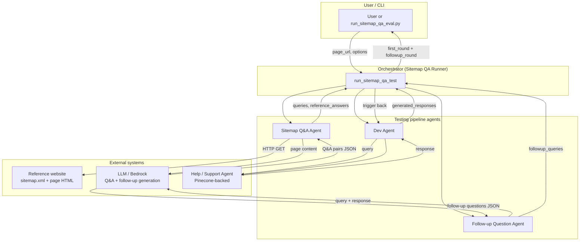
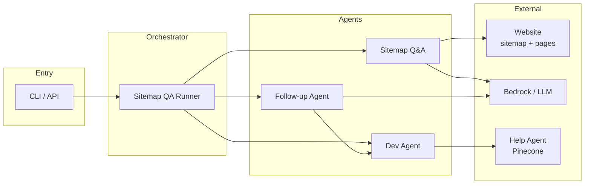
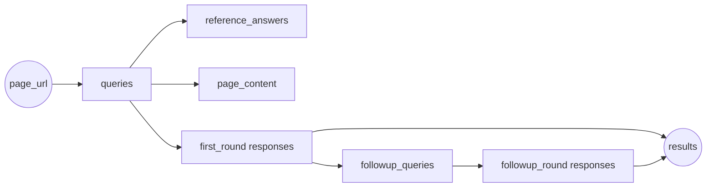
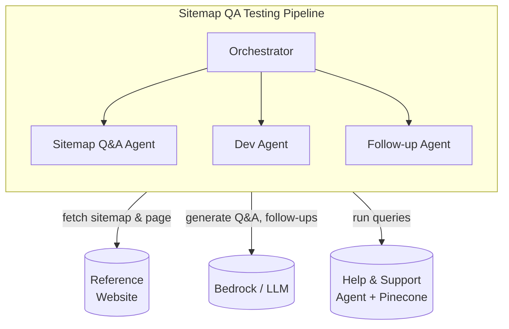
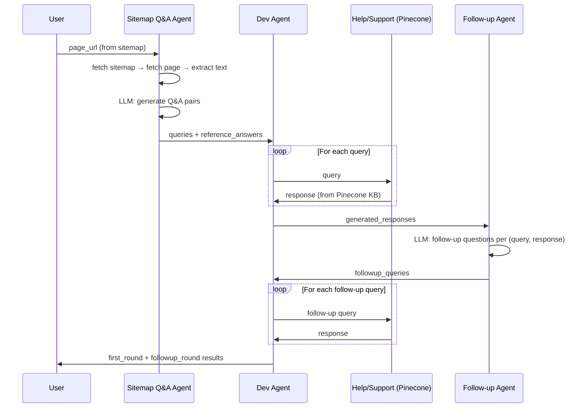

# Sitemap-Based Help & Support Agent Testing

This flow tests a **help/support agent** that uses **Pinecone** (or similar) to retrieve answers built from reference website content (e.g. from a [sitemap](https://example.com/sitemap.xml)).

---

## Architecture diagram

High-level system architecture: components, external systems, and data flow.



**Component view (layers):**



**Data flow (artifacts):**



**System context (what the pipeline uses):**



---

## Flow diagram (QA approach)

```mermaid
flowchart LR
    subgraph Input
        A[User: page URL or sitemap link]
    end

    subgraph "1. Sitemap Q&A Agent"
        B[Fetch sitemap XML]
        C[Fetch page HTML]
        D[Extract text content]
        E[LLM: generate Q&A pairs]
        B --> C --> D --> E
    end

    subgraph "2. First round"
        F[Dev Agent]
        G[Help/Support Agent<br/>Pinecone-backed]
        F --> G
    end

    subgraph "3. Follow-up Agent"
        H[LLM: generate follow-up<br/>questions from each response]
    end

    subgraph "4. Trigger back"
        I[Dev Agent again]
        J[Help/Support Agent]
        I --> J
    end

    A --> B
    E --> |queries + ref answers| F
    G --> |responses| H
    H --> |follow-up queries| I
```



**High-level sequence:**



**Simplified flow (boxes):**

```
┌─────────────────┐     ┌─────────────────┐     ┌─────────────────┐     ┌─────────────────┐
│  Sitemap Q&A    │     │   Dev Agent     │     │ Follow-up       │     │   Dev Agent     │
│  Agent          │────▶│   (1st round)   │────▶│ Question Agent  │────▶│   (2nd round)   │
│                 │     │                 │     │                 │     │                 │
│ • Fetch sitemap │     │ • Run queries   │     │ • From each     │     │ • Run follow-up │
│ • Fetch page    │     │   vs Help agent │     │   (Q, response) │     │   queries       │
│ • Extract text  │     │   (Pinecone)    │     │   generate      │     │   vs Help agent  │
│ • LLM → Q&A     │     │ • Collect       │     │   follow-up Qs   │     │ • Collect       │
│   pairs         │     │   responses     │     │ • trigger_back  │     │   responses     │
└─────────────────┘     └─────────────────┘     └─────────────────┘     └─────────────────┘
      ▲                                                                         │
      │ page_url                                                                 │
      └─────────────────────────────────────────────────────────────────────────┘
                                    final results (first_round + followup_round)
```

## Overview

1. **Sitemap Q&A Agent** – Reads a link (from the sitemap or your input), fetches the page, and generates possible questions and reference answers for that page.
2. **Dev Agent** – Runs each of those queries against your help/support agent (Pinecone-backed) and collects responses.
3. **Follow-up Question Agent** – Reads each response and generates follow-up questions a customer might ask next.
4. **Trigger back** – Runs those follow-up questions through the Dev Agent again.

## Agents

| Agent | Role |
|-------|------|
| `SitemapQAAgent` | Fetch sitemap → fetch page by URL → extract content → LLM generates Q&A pairs |
| `DevAgent` | Send queries to your help/support agent (AgentCore / Pinecone) |
| `FollowUpQuestionAgent` | From each (query, response) generate follow-up questions and output them for a second Dev round |

## Configuration

In `config/config.yaml`:

```yaml
sitemap_qa:
  sitemap_url: "https://example.com/sitemap.xml"
  max_qa_pairs: 15
  max_followups_per_turn: 3
```

Set `agentcore.base_url` (and optional `agentcore.bill.agent_name`) to point at your deployed help/support agent.

## Running

### CLI

```bash
# First page in sitemap
python run_sitemap_qa_eval.py

# Specific page
python run_sitemap_qa_eval.py --page-url "https://example.com/help/contact-us"

# Custom AgentCore URL
python run_sitemap_qa_eval.py --agentcore-url "http://localhost:8000" --page-url "https://example.com/help/contact-us"

# No follow-up round
python run_sitemap_qa_eval.py --no-followup

# Save result to file
python run_sitemap_qa_eval.py --page-url "..." --output result.json
```

### Programmatic

```python
from orchestration.sitemap_qa_runner import run_sitemap_qa_test

result = await run_sitemap_qa_test(
    page_url="https://example.com/help/contact-us",
    agentcore_base_url="http://localhost:8000",
    run_followup_round=True,
)
# result["sitemap_qa"], result["first_round"], result["followup_queries"], result["followup_round"]
```

## Output shape

- **sitemap_qa**: `page_url`, `queries`, `qa_pairs`, `reference_answers`
- **first_round**: list of `{query, response, context_used, metadata}` from Dev Agent
- **followup_queries**: list of follow-up question strings
- **followup_round**: (if run) list of Dev Agent responses for those follow-ups

## Dependencies

- `beautifulsoup4` for parsing HTML from sitemap pages
- `requests` for fetching sitemap and page content
- Bedrock (or configured LLM) for generating Q&As and follow-up questions

## Implementation prompt for your project

To replicate this flow in another codebase, use the full **implementation prompt** in **[SITEMAP_QA_IMPLEMENTATION_PROMPT.md](SITEMAP_QA_IMPLEMENTATION_PROMPT.md)**. It includes:

- Copy-paste prompt describing the flow, technical requirements, and the two LLM prompts (Q&A generation, follow-up generation)
- Mermaid flow diagram
- Suggested file layout and config
- Reference to this repo's implementation
